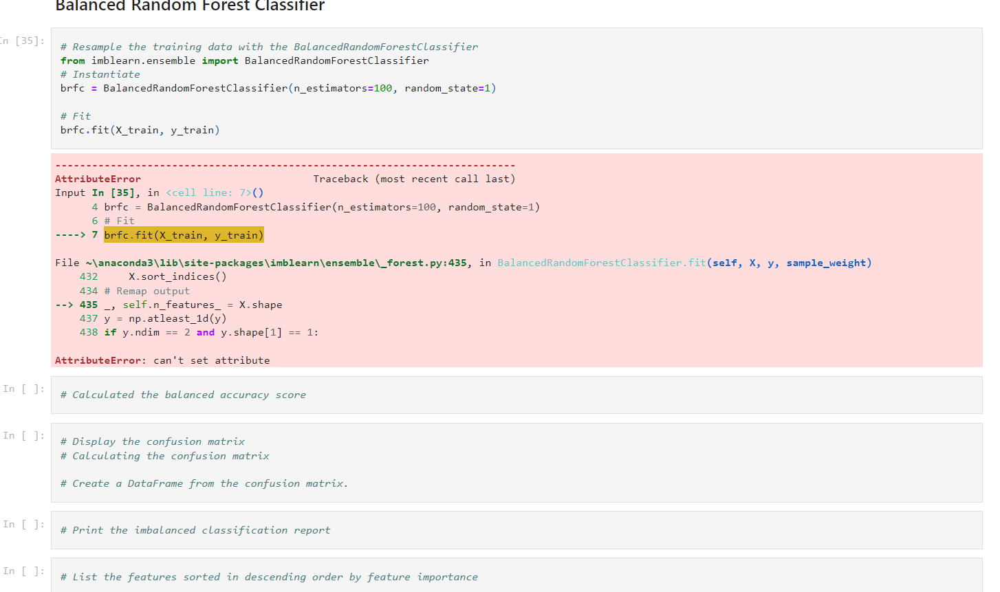

# Credit_Risk_Analysis

# Results

## Balanced Random Forest Classifier

Imma just rip the bandaid off first, I tried everything to run this but I always got that "cant do attribute" error. I changed the version, restarted the kernel and rewrote everywich way but noting. So that whole section got all messed up

## Random Oversampling

The balanced accuracy score comes out to be 65%

The low_risk precision is close to 100% with a sensitivity of 68%

The high_risk precision is about 1% with a sensitivity of 62%

## SMOTE

The precision values of the high and low risk variables mimics the Random Oversampling model

The f1 score drops slightly to 79% instead of 81%

The sensitivity scores level out as well with low_risk being 66% and high_risk being 59%

